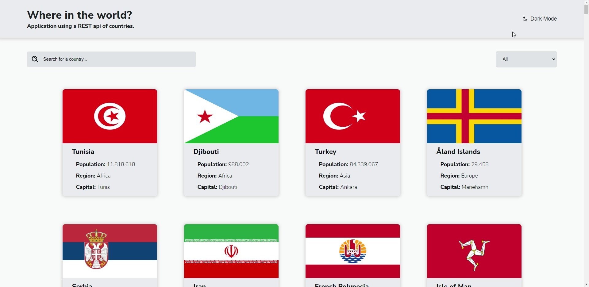
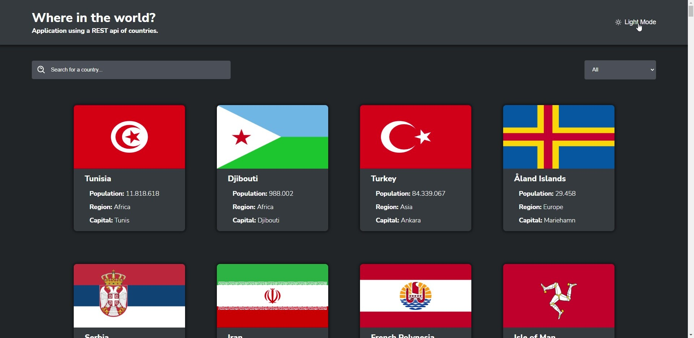

  

## 📚 Sobre
Projeto desenvolvido com o intuito de treinar os conhecimentos sobre React.js + Typescript, juntamente com requisições HTTP, criação de hooks, roteamento com o react-router e dark mode com styled-components.

Está é uma aplicação que utiliza uma API Rest de países do mundo, onde encontramos bandeiras, nomes comuns, população e outras diversas informações.

## 📸 Imagens

  
  

## 🧰 Linguagens
  - React.js
  - Typescript
  - styled-components
  - react-router
  - yarn

## 👨🏽‍💻 Autor
#### Feito com 🤎 por *[Gabriel Bittencourt Penteado](https://www.linkedin.com/in/gabriel-bittencourt-penteado/)*. Entre em contato! 👋🏽